# Google Analytics Tracking Workflow

## System Overview

This document shows how Google Analytics 4 (GA4) tracks events across the entire ClearVocals platform.

---

## Environment Variables

```env
GA_MEASUREMENT_ID=G-WHZ0X8J9PJ
GA_API_SECRET=ePmKGNiGS126gxaqp6N-4w
ENABLE_ANALYTICS=true
```

---

## Architecture Diagram


---

## Event Flow Diagrams

### 1. Purchase Flow


### 2. Feature Usage Flow (Dubbing)


### 3. API Usage Tracking (Backend)


---

## Event Types & Data Structure

### Frontend Events

#### 1. Purchase Event


**Trigger:** Payment success page  
**File:** `frontend/src/app/payment/success/page.tsx`

#### 2. Subscribe Event


**Trigger:** Subscription activation  
**File:** `frontend/src/app/subscription/success/page.tsx`

#### 3. Feature Use Event


**Trigger:** User starts feature  
**Files:** 
- `frontend/src/app/workspace/dubbing/start/page.tsx`
- `frontend/src/components/clips/ClipUpload.tsx`
- `frontend/src/hooks/useSeparation.ts`

---

### Backend Events

#### 4. API Usage Event


**Trigger:** Third-party API call  
**Files:**
- `backend/app/services/dub/elevenlabs_service.py`
- `backend/app/services/dub/fish_speech_service.py`
- `backend/app/services/clip_service.py`
- `backend/app/services/dub/ai_segmentation_service.py`

---

## Data Flow Summary


---

## Tracking Coverage

### ✅ Fully Tracked

| Action | Event | Location | Status |
|--------|-------|----------|--------|
| Credit Purchase | `purchase` | Frontend | ✅ |
| Subscription Activation | `subscribe` | Frontend | ✅ |
| Start Dubbing | `feature_use` | Frontend | ✅ |
| Start Clips | `feature_use` | Frontend | ✅ |
| Start Separation | `feature_use` | Frontend | ✅ |
| ElevenLabs API Call | `api_usage` | Backend | ✅ |
| FishSpeech API Call | `api_usage` | Backend | ✅ |
| OpenAI GPT Call | `api_usage` | Backend | ✅ |

---

## View Your Data

### Real-time Dashboard


**URL:** https://analytics.google.com → Reports → Realtime

### Custom Reports


---

## Technical Implementation

### Frontend Stack


### Backend Stack


---

## Cost Tracking (Future Enhancement)

```mermaid
flowchart TD
    A[API Usage Event] --> B{Provider?}
    
    B -->|ElevenLabs| C1[chars × $0.0001]
    B -->|FishSpeech| C2[Custom pricing]
    B -->|OpenAI| C3[tokens × $0.002]
    
    C1 --> D[Estimated Cost]
    C2 --> D
    C3 --> D
    
    D --> E[GA4 Custom Metric]
    E --> F[Cost Reports]
    
    style A fill:#4285f4,color:#fff
    style D fill:#34a853,color:#fff
    style F fill:#ea4335,color:#fff
```



---

## Success Metrics

### KPIs You Can Track


---

## Getting Started

1. **✅ Environment Variables Set**
   ```env
   GA_MEASUREMENT_ID=G-WHZ0X8J9PJ
   GA_API_SECRET=ePmKGNiGS126gxaqp6N-4w
   ENABLE_ANALYTICS=true
   ```

2. **✅ Frontend Tracking Active**
   - Purchase events
   - Subscription events
   - Feature usage events

3. **✅ Backend Tracking Active**
   - ElevenLabs API calls
   - FishSpeech API calls
   - OpenAI API calls

4. **📊 View Data**
   - Real-time: https://analytics.google.com → Realtime
   - Reports: https://analytics.google.com → Reports
   - Custom: https://analytics.google.com → Explore

---

## Troubleshooting Flow

```mermaid
flowchart TD
    Start([Events not showing?]) --> Check1{API Secret set?}
    
    Check1 -->|No| Fix1[Add GA_API_SECRET to .env]
    Check1 -->|Yes| Check2{Check logs?}
    
    Check2 --> Check3{Errors in logs?}
    Check3 -->|Yes| Fix2[Fix API errors]
    Check3 -->|No| Check4{Wait 24 hours?}
    
    Check4 -->|No| Fix3[Wait for GA4 processing]
    Check4 -->|Yes| Check5{Check Realtime?}
    
    Check5 -->|Events there| Success1[✅ Working - wait for reports]
    Check5 -->|No events| Fix4[Check network requests]
    
    Fix1 --> Restart[Restart Backend]
    Fix2 --> Restart
    Restart --> Test[Test API call]
    Test --> Success2[✅ Events appear]
    
    style Start fill:#ea4335,color:#fff
    style Success1 fill:#34a853,color:#fff
    style Success2 fill:#34a853,color:#fff
```



---

**সম্পূর্ণ Analytics System এখন Active! 🎯📊**

